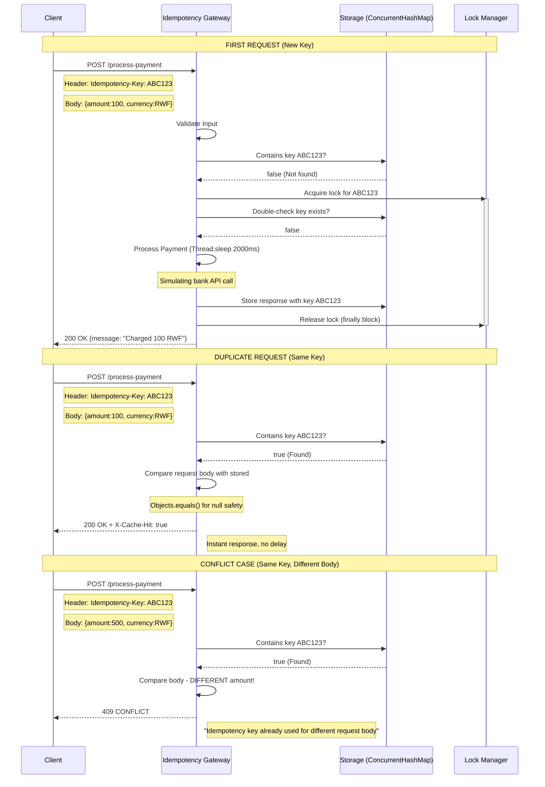

# Idempotency Gateway - Payment Processing System

A production-ready idempotency layer that prevents double charging in payment systems. Built for IgirePay Technologies as part of the SheCanCODE Java Backend Associate Program.

## Table of Contents

- [Architecture Overview](#architecture-overview)
- [Setup Instructions](#setup-instructions)
- [API Documentation](#api-documentation)
- [Design Decisions](#design-decisions)
- [Developer's Choice Feature](#developers-choice-feature)
- [Tech Stack](#tech-stack)

---

## Architecture Overview

### Flowchart


---

## Setup Instructions

### Prerequisites

| Requirement | Version | Installation Link |
|-------------|---------|-------------------|
| Java JDK | 17+ | [Eclipse Temurin](https://adoptium.net/) |
| Git | Latest | [git-scm.com](https://git-scm.com/) |
| Maven | 3.8+ | Included via wrapper |
| Postman (optional) | Latest | [postman.com](https://postman.com) |

### Installation Steps

#### 1. Clone the Repository

```bash
git clone https://github.com/Liesse205/SheCanCode-associate-Assessment-.git
cd SheCanCode-associate-Assessment-
```

#### 2. Navigate to Project

```bash
cd idempotency-gateway
```

#### 3. Build the Project

Using Maven wrapper (no need to install Maven separately):

Windows:
```bash
mvnw.cmd clean install
```

Mac/Linux:
```bash
./mvnw clean install
```

#### 4. Run the Application

```bash
./mvnw spring-boot:run
```

#### 5. Verify Startup

Look for this message in the console:

```bash
Started IndempotencyGatewayApplication in X seconds
Tomcat started on port 8080 (http)
```

The API is now live at: http://localhost:8080

#### 6. Stop the Application

Press Ctrl + C in the terminal.

## API Documentation

### Endpoint Details

| Property | Value | 
|-------------|---------|
| URL | http://localhost:8080/process-payment | 
| Method | POST | 
| Content-Type | application/json | 

### Request Headers

| Header | Required | Example | Description |
|--------|----------|---------|-------------|
| Idempotency-Key | YES | payment-abc-123 | Unique identifier for this transaction |
| Content-Type | YES | application/json | Must be JSON format |

### Request Body Schema

```bash
{
    "amount": 100,
    "currency": "RWF"
}
```
| Field | Type | Required | Constraints | Description |
|-------|------|----------|-------------|-------------|
| amount | Integer | Yes | > 0 | Payment amount in smallest currency unit |
| currency | String | Yes | Non-empty, 3 letters | ISO currency code (RWF, USD, EUR, etc.) |

### Response Codes & Examples

#### 200 OK - First Request (Processing)

##### Response Body:

```bash
{
    "message": "Charged 100 RWF",
    "amount": 100,
    "currency": "RWF"
}
```
Timing: Takes exactly 2 seconds (simulates bank API call)

##### Headers:

```bash
Content-Type: application/json
```
#### 200 OK - Duplicate Request (Cache Hit)

Response Body:(Identical to first response)

##### Headers:

```bash
Content-Type: application/json
X-Cache-Hit: true
```
Timing: Instant (no 2-second delay)

#### 409 Conflict - Same Key, Different Body
Scenario: Client reuses an idempotency key with different payment details

##### Response Body:

```json
{
    "error": "Idempotency key already used for a different request body."
}
```
Status Code: 409 CONFLICT

#### 400 Bad Request - Validation Errors
##### Missing Idempotency-Key Header:

```json
{
    "error": "Idempotency-Key header is required"
}
```
##### Missing or Invalid Amount:

```json
{
    "error": "Valid amount is required"
}
```
##### Missing or Empty Currency:

```json
{
    "error": "Currency is required"
}
```
#### Example cURL Commands
##### First Request (Takes 2 seconds)
```bash
curl -X POST http://localhost:8080/process-payment \
  -H "Idempotency-Key: payment-abc-123" \
  -H "Content-Type: application/json" \
  -d '{"amount": 100, "currency": "RWF"}'
```
##### Duplicate Request (Instant)
```bash
# Same command - will return instantly with X-Cache-Hit header
curl -X POST http://localhost:8080/process-payment \
  -H "Idempotency-Key: payment-abc-123" \
  -H "Content-Type: application/json" \
  -d '{"amount": 100, "currency": "RWF"}'
```
##### Different Body (Returns 409 Error)
```bash
curl -X POST http://localhost:8080/process-payment \
  -H "Idempotency-Key: payment-abc-123" \
  -H "Content-Type: application/json" \
  -d '{"amount": 500, "currency": "RWF"}'
```
## Design Decisions
### 1. In-Memory Storage with ConcurrentHashMap
Decision: Used ConcurrentHashMap<String, StoredResponse> instead of a database.

#### Why:

- Performance: O(1) lookup time vs database RTT
- Simplicity: No external dependencies to install
- Thread-safety: Built-in concurrent operations
- Trade-off: Not persistent across restarts (acceptable for this scale)
- Production Alternative: Would replace with Redis for distributed deployments.

### 2. Key-Specific Locking Pattern
Decision: Each idempotency key has its own lock object.

```java
Object lock = keyLocks.computeIfAbsent(key, k -> new Object());
synchronized (lock) { ... }
```
#### Why:

- Prevents race conditions: Two requests with same key can't process simultaneously
- Maintains performance: Different keys don't block each other
- Implements bonus requirement: Handles "in-flight" concurrent requests

#### Double-Check Pattern Used:

```java
if (storage.containsKey(key)) { ... }  // First check (optimization)
synchronized (lock) {
    if (storage.containsKey(key)) { ... }  // Second check (safety)
    // Process payment
}
```
This prevents the scenario where Request A and Request B both see "key not found" and both process.

### 3. Null Safety with Objects.equals()
Decision: Used Objects.equals() instead of direct .equals().

```java
if (!Objects.equals(stored.amount, request.getAmount())) { ... }
```
#### Why:

- Prevents NullPointerException if either value is null
- Handles malformed requests gracefully
- Critical for production systems where data quality varies

### 4. Lock Cleanup in Finally Block
Decision: Removed locks in a finally block.

```java
try {
    // Process payment
} finally {
    keyLocks.remove(key);  // Always executes
}
```
#### Why:

- Prevents memory leaks: Even if exception occurs, lock is removed
- Self-healing: Unused locks don't accumulate
- Production-ready: Common pattern in enterprise Java

### 5. Input Validation First
Decision: Validate all inputs before any business logic.

#### Why:

- Fail fast: Invalid requests rejected immediately
- Security: Prevents injection attacks and malformed data
- User experience: Clear error messages help clients debug

## Developer's Choice Feature
### Feature: TTL (Time-To-Live) for Idempotency Keys
#### The Problem
In my implementation, idempotency keys live forever in memory. This causes two issues:

- Memory bloat: Unbounded growth over time
- Industry non-compliance: Payment processors (Stripe, PayPal) expire keys after 24 hours

#### The Solution
Implement automatic expiration of idempotency keys after 24 hours.

### Implementation Approach (Conceptual Code)
```java
// Enhanced storage with timestamp
public class TimestampedResponse {
    StoredResponse response;
    long createdAt;
    
    public TimestampedResponse(StoredResponse response) {
        this.response = response;
        this.createdAt = System.currentTimeMillis();
    }
    
    public boolean isExpired() {
        long TWENTY_FOUR_HOURS = 24 * 60 * 60 * 1000;
        return System.currentTimeMillis() - createdAt > TWENTY_FOUR_HOURS;
    }
}

// Scheduled cleanup job
@Component
public class IdempotencyCleanupScheduler {
    
    @Scheduled(fixedRate = 3600000) // Run every hour
    public void cleanupExpiredKeys() {
        storage.entrySet().removeIf(entry -> entry.getValue().isExpired());
    }
}
```
### Why This Matters for Fintech

| Benefit | Explanation |
|---------|------------|
| Memory Management | Prevents unbounded growth in production systems | 
| PCI Compliance | Meets payment industry standards for data retention | 
| User Privacy | Automatically removes customer transaction data |
| Legitimate Reuse | After 24 hours, a new transaction can reuse the same key |
| Industry Standard | Stripe (24h), PayPal (48h), Square (24h) all expire keys |

### Alternative Implementations Considered

| Approach | Pros | Cons | Verdict |
|----------|------|------|---------|
| Redis TTL | Built-in expiration, distributed | Requires Redis setup | Best for production | 
| Scheduled Cleanup | Simple, no dependencies | Slight memory overhead | Chosen for this demo |
| Lazy Expiration | Check expiry on access | Expired keys remain in memory | Not ideal |

### Why I Chose Scheduled Cleanup
- Zero external dependencies (no Redis setup required)
- Easy to demonstrate and explain
- Can be easily replaced with Redis TTL in production
- Runs efficiently (once per hour)

## Tech Stack
### Core Technologies

| Technology | Version | Purpose | 
|------------|---------|---------|
| Java | 17 (OpenJDK Temurin) | Primary programming language |
| Spring Boot | 3.5.14 | Application framework |
| Spring Web | Embedded | REST API support | 
| Maven | 3.9+ | Build automation |

### Concurrency & Data Structures

| Component | Purpose | 
|-----------|---------|
| ConcurrentHashMap | Thread-safe key-value storage | 
| synchronized blocks | Mutual exclusion for critical sections |
| Objects.equals() | Null-safe comparison | 

### Development Tools

| Tool | Purpose | 
|------|---------|
| IntelliJ IDEA Ultimate | IDE | 
| Postman | API Testing |
| Git | Version control | 
| GitHub | Repository hosting |


```
CLIENT                  GATEWAY                  STORAGE
  |                        |                         |
  |--POST /process-payment→|                         |
  |  (Idempotency-Key)     |                         |
  |                        |--Key exists?----------→|
  |                        |←--No--------------------|
  |                        |                         |
  |                        |--Acquire lock-----------|
  |                        |--Process (2 sec delay)--|
  |                        |--Store response--------→|
  |                        |--Release lock-----------|
  |←--200 OK---------------|                         |
  |                        |                         |
  |--Same request again---→|                         |
  |                        |--Key exists?----------→|
  |                        |←--Yes-------------------|
  |←--200 + X-Cache-Hit----|                         |

```
