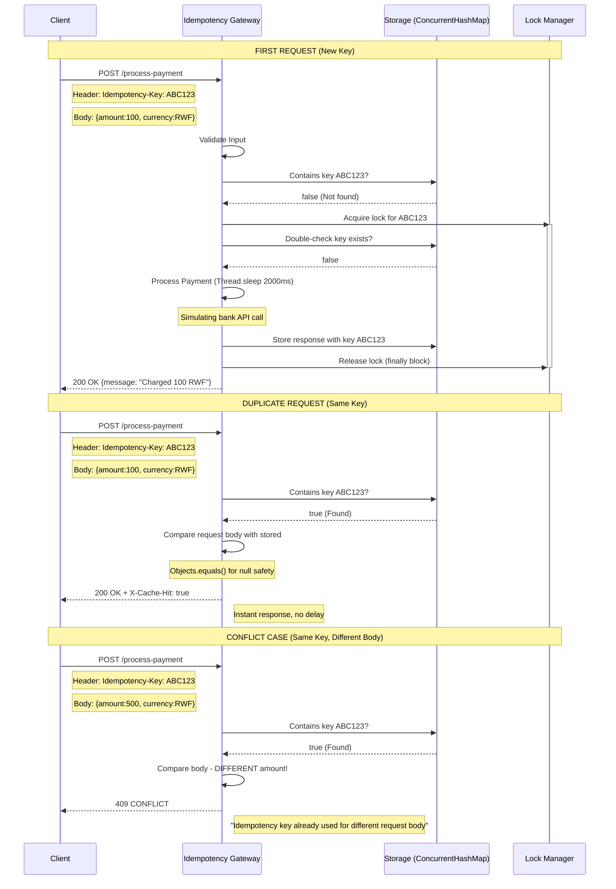

# Idempotency Gateway - Payment Processing System

A production-ready idempotency layer that prevents double charging in payment systems. Built for IgirePay Technologies as part of the SheCanCODE Java Backend Associate Program.

## Table of Contents

- [Architecture Overview](#architecture-overview)
- [Setup Instructions](#setup-instructions)
- [API Documentation](#api-documentation)
- [Design Decisions](#design-decisions)
- [Developer's Choice Feature](#developers-choice-feature)
- [Test Results](#test-results)
- [Tech Stack](#tech-stack)

---

## Architecture Overview

### Flowchart


---

## Setup Instructions

### Prerequisites

| Requirement | Version | Installation Link |
|-------------|---------|-------------------|
| Java JDK | 17+ | [Eclipse Temurin](https://adoptium.net/) |
| Git | Latest | [git-scm.com](https://git-scm.com/) |
| Maven | 3.8+ | Included via wrapper |
| Postman (optional) | Latest | [postman.com](https://postman.com) |

### Installation Steps

#### 1. Clone the Repository

```bash
git clone https://github.com/Liesse205/SheCanCode-associate-Assessment-.git
cd SheCanCode-associate-Assessment-
```

#### 2. Navigate to Project

```bash
cd idempotency-gateway
```

#### 3. Build the Project

Using Maven wrapper (no need to install Maven separately):

Windows:
```bash
mvnw.cmd clean install
```

Mac/Linux:
```bash
./mvnw clean install
```

#### 4. Run the Application

```bash
./mvnw spring-boot:run
```

#### 5. Verify Startup

Look for this message in the console:

```bash
Started IndempotencyGatewayApplication in X seconds
Tomcat started on port 8080 (http)
```

The API is now live at: http://localhost:8080

#### 6. Stop the Application

Press Ctrl + C in the terminal.

## API Documentation

### Endpoint Details

| Property | Value | 
|-------------|---------|
| URL | http://localhost:8080/process-payment | 
| Method | POST | 
| Content-Type | application/json | 

### Request Headers

| Header | Required | Example | Description |
|--------|----------|---------|-------------|
| Idempotency-Key | YES | payment-abc-123 | Unique identifier for this transaction |
| Content-Type | YES | application/json | Must be JSON format |

### Request Body Schema

```bash
{
    "amount": 100,
    "currency": "RWF"
}
```
| Field | Type | Required | Constraints | Description |
|-------|------|----------|-------------|-------------|
| amount | Integer | Yes | > 0 | Payment amount in smallest currency unit |
| currency | String | Yes | Non-empty, 3 letters | ISO currency code (RWF, USD, EUR, etc.) |

### Response Codes & Examples

200 OK - First Request (Processing)
Response Body:

```bash
{
    "message": "Charged 100 RWF",
    "amount": 100,
    "currency": "RWF"
}
```
Timing: Takes exactly 2 seconds (simulates bank API call)
Headers:

```bash
Content-Type: application/json
```


